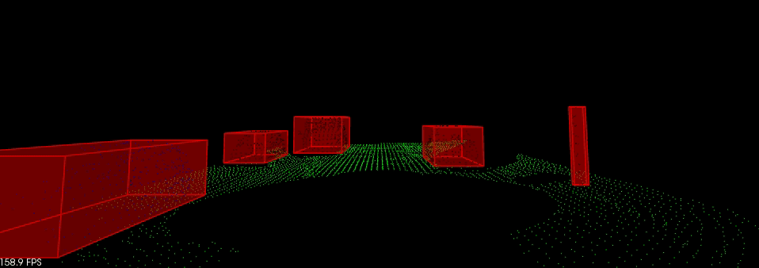

# LiDAR-Obstacle-Detection
First project of Udacity Sensor Fusion Nanodegree Program.
Segment and detect obstacles from real lidar point cloud data using self-implemented kd-tree, euclidean clustering, RANSAC segmentation functions.  
The structure of the environement is written by Aaron Brown.


## How To Run
```
git clone https://github.com/kerwin112ME/LiDAR-Obstacle-Detection.git  
```
cd to the LiDAR-Obstacle-Detection directory  
```
mkdir build  
cd build
cmake ..
make
```
run the environment  
```
./environment
```
